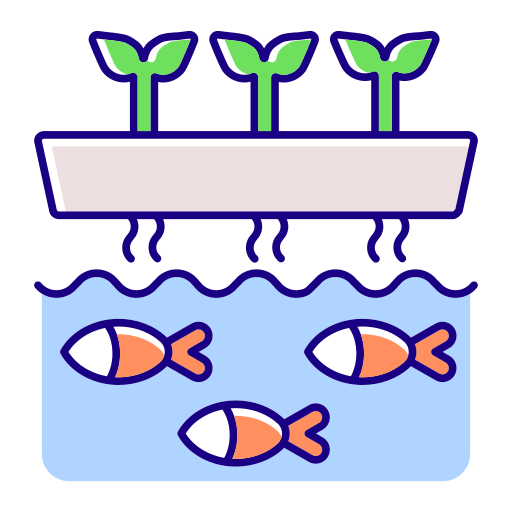

# science-mill-aquaponics
Science Mill Aquaponics 

[![LinkedIn][linkedin-shield]][linkedin-url]

<h2>Client</h2>

Contract: Subvrsive

<b>for Science Mill</b>

<!-- PROJECT LOGO -->
 

 

  

<h3 align="center">Science Mill Aquaponics </h3>

  

Augmented reality experience for Science Mill. Created with Unity3D and AR-Foundation.
  

 

<!-- ABOUT THE PROJECT -->
## About The Project

 

 
 This interesting AR project was created to explain in a interactive and fun way, the whole process of aquaponics, using animated 3D models anchored to image targets.

 
  <h3>Challenges</h3
   

     Creating a image targed based AR experience can be straight foward, but there are challenges specific to this context. World positioning and integrating UI interactions (drag and drop) to the 3D enviroment where the biggest challenges. With a good understanding of 3D development and the AR foundation library, along with the best practices for Unity 3D, I was able to create a smooth and interesting experience that not only teaches about this process in a scientific, but also fun way. Another challenge was handling data, but with the use of [scriptable objects](https://docs.unity3d.com/Manual/class-ScriptableObject.html) this dedicated app was scallable.
   

 

https://github.com/victorcappa/science-mill-aquaponics/assets/40408965/d99ca077-abce-4192-9736-5e60464537c8

(<a href="#top">back to top</a>)

<!-- LICENSE -->
## License

All intellectual property is owned Science Mill.

(<a href="#top">back to top</a>)

<!-- CONTACT -->
## Contact

Reach out - <a href = "mailto: victorcappa@imaginar.dev">Victor Cappa</a>
<a href="https://www.linkedin.com/in/victor-cappa-50839788/">Linkedin</a>

(<a href="#top">back to top</a>)

[linkedin-shield]: https://img.shields.io/badge/-LinkedIn-black.svg?style=for-the-badge&logo=linkedin&colorB=555
[linkedin-url]: https://www.linkedin.com/in/victor-cappa-50839788/

